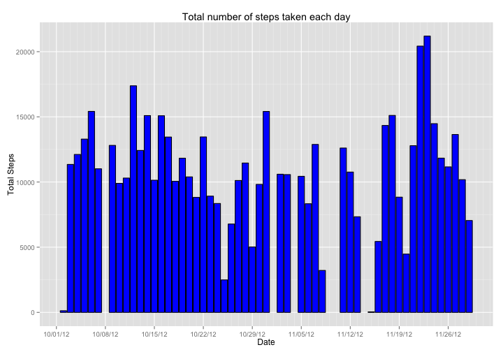
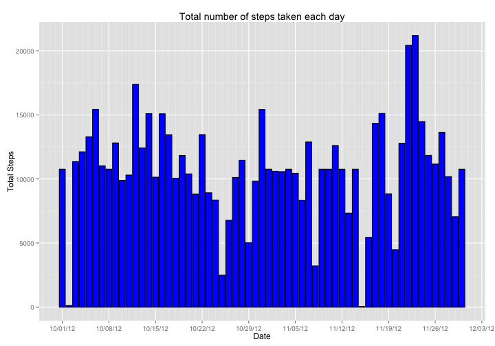
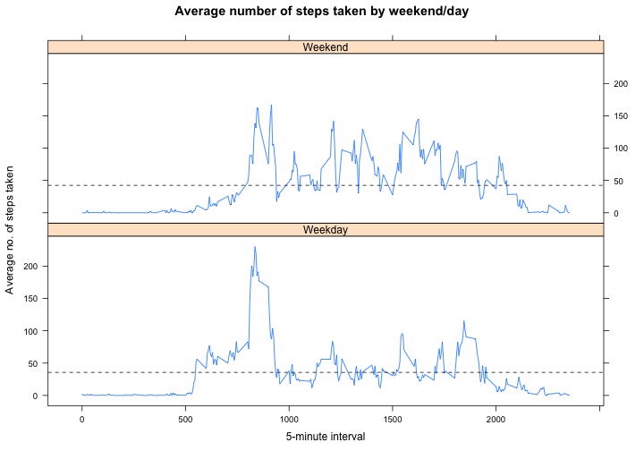

# Reproducible Research: Peer Assessment 1

Setting the libraries and global options for the document:

```r
## Peer assessment 1 - Scuba22

# Ensure all necessary libraries are read in (some may not be needed in final cut)
library(ggplot2)
library(scales)
library(knitr)
library(lattice) 
library(data.table)

opts_chunk$set(warning = FALSE, message = FALSE, echo = TRUE, 
               fig.width = 10)
```
Note that the `echo = FALSE` parameter was added to the code chunk to prevent printing of the R code that generated the plot.  `warning = FALSE` and `message = FALSE` are added to remove the uncessary warnings and messages when producing the plots.  Finally added `fig.width = 10` to make the plots wider and easier to read.


## Loading and preprocessing the data

Below is the code used to produce the base data:

```r
# Set the location of the data to use
fileurl<-"https://d396qusza40orc.cloudfront.net/repdata%2Fdata%2Factivity.zip"

# Set the name of the zip file we wish to extract
myzip = "Factivity.zip"

# If data file has not yet been downloaded then fetch it otherwise move on
if (!file.exists(myzip)) {
  download.file(fileurl, destfile=myzip, method="curl")
  unzip(myzip)
}

# Read the data in
activity <- read.csv("./activity.csv", header=TRUE, sep=",", 
                     stringsAsFactors=FALSE, na.strings = c(NA, "NA", 'NA'))

# Format the date correctely
activity$date <- as.Date(activity$date, "%Y-%m-%d")

# Create version with NA removed for first parts
dailysteps <- subset(activity, activity$steps != "NA")
dailysteps$steps <- sapply(dailysteps$steps, as.integer)

# Create aggregations for the plots
mean1 <- aggregate(steps~date, dailysteps, sum)
mean2 <- aggregate(steps~date, dailysteps, mean)
mean3 <- aggregate(steps~date, dailysteps, median)
avgdap1 <- aggregate(steps~interval, dailysteps, mean)
```


## What is mean total number of steps taken per day?


```r
# Create plot to show total number of steps per day
qplot(mean1$date, mean1$steps, geom="bar", stat="identity", colour=I("black"), fill = I("blue")) + 
  xlab("Date") +
  ylab("Total Steps") +
  ggtitle("Total number of steps taken each day") +
  scale_x_date(breaks = "1 week", minor_breaks = "1 day", labels=date_format("%D"))
```

 

```r
# Create the plots to show the mean and median
par(mfrow=c(1,2)) 
plot(mean2$date, mean2$steps, 
     type="l", xlab="Date", ylab="Mean of Daily Steps",
     main="Mean no. of steps each day")
plot(mean3$date, mean3$steps, 
     type="l", xlab="Date", ylab="Median of Daily Steps",
     main="Median no. of steps each day")
```

 

The median suggests that a majority of the intervals are populated with 0 and that our ditsribution is skewed.


## What is the average daily activity pattern?


```r
# Create the plot for the average steps by interval
plot(avgdap1$interval, avgdap1$steps, 
     type="l", xlab="5-minute interval", ylab="Average no. of steps taken",
     main="Average number of steps taken (averaged across all days)")
```

 

```r
# Uses the which.max function to find the row of the highest value and display it
sprintf("The 5-minute interval, on average across all the days in the dataset, containing the maximum number of steps is %s", 
        avgdap1[apply(avgdap1, 2, which.max)[2], 1])
```

```
## [1] "The 5-minute interval, on average across all the days in the dataset, containing the maximum number of steps is 835"
```


## Imputing missing values


```r
# Calculate the number of NA
sprintf("The total number of rows missing/NA steps is %s", 
        nrow(subset(activity, is.na(activity$steps) == TRUE)))
```

```
## [1] "The total number of rows missing/NA steps is 2304"
```

Below is the code used to fill in the blank values using the mean value of that missing interval from the entire date range:


```r
# Create population of NAs to fix
tocorrect <- subset(activity, is.na(activity$steps) == TRUE)

# Use previous data on mean by interval to create replacement set
imputed<-merge(tocorrect, avgdap1, by.x = "interval", by.y = "interval", 
               all=FALSE)
colnames(imputed) <- c("interval", "NA", "date", "steps")

# Retain what we need and amend the dailysteps file ready for cbind
imputed <- imputed[, c("steps", "date", "interval")]
dailysteps <- dailysteps[, c("steps", "date", "interval")]

# Create an imputed set for use
corrected<-rbind(imputed, dailysteps)

# Create the new tables for the plots below
meancorr1 <- aggregate(steps~date, corrected, sum)
meancorr2 <- aggregate(steps~date, corrected, mean)
meancorr3 <- aggregate(steps~date, corrected, median)


# Create plot to show total number of steps per day
qplot(meancorr1$date, meancorr1$steps, geom="bar", stat="identity", colour=I("black"), fill = I("blue")) + 
  xlab("Date") +
  ylab("Total Steps") +
  ggtitle("Total number of steps taken each day") +
  scale_x_date(breaks = "1 week", minor_breaks = "1 day", labels=date_format("%D"))
```

 

I have brought together the previous graphs with the imputed data for comparison:


```r
# Create the plots to show the mean and median
par(mfrow=c(2,2)) 
plot(mean2$date, mean2$steps, 
     type="l", xlab="Date", ylab="Mean of Daily Steps",
     main="Mean no. of steps each day")
plot(mean3$date, mean3$steps, 
     type="l", xlab="Date", ylab="Median of Daily Steps",
     main="Median no. of steps each day")
plot(meancorr2$date, meancorr2$steps, 
     type="l", xlab="Date", ylab="Mean of Daily Steps",
     main="Mean no. of steps each day")
plot(meancorr3$date, meancorr3$steps, 
     type="l", xlab="Date", ylab="Median of Daily Steps",
     main="Median no. of steps each day")
```

 

The changes have had a significant impact early on where there was a large % volume of NA but later on it has actually helped to provide some better definition matching the general pattern; the point of interest is around the spike on median.  The trend tends towards to 0 but there are peaks which would warrant further investigation but, theoretically, driven by the large volume on NA's on those days previously (maybe meaning true value is closer to 0?).

## Are there differences in activity patterns between weekdays and weekends?

```r
# Create new column for named day of week
corrected["weekday"] <- weekdays(corrected$date)

# Update the days to make a weekend/day category
corrected$weekday[corrected$weekday == "Saturday"] <- "Weekend"
corrected$weekday[corrected$weekday == "Sunday"] <- "Weekend"
corrected$weekday[corrected$weekday != "Weekend"] <- "Weekday"

# Create aggregation for the plot
weekendday <- aggregate(steps~weekday+interval, corrected, mean)

# Create the final plot
xyplot(steps ~ interval | weekday, data = weekendday, layout = c(1,2),
       type="l", xlab="5-minute interval", ylab="Average no. of steps taken",
       main="Average number of steps taken by weekend/day", 
       panel = function(x, y, ...) {
         panel.xyplot(x, y, ...) 
         panel.abline(h = mean(y), lty = 2, heading = "f") 
       })
```

 

Although we do see a significant spike in weekday activity, the mean (dotted line) shows us that overall activity on the weekend is higher and better distributed.

